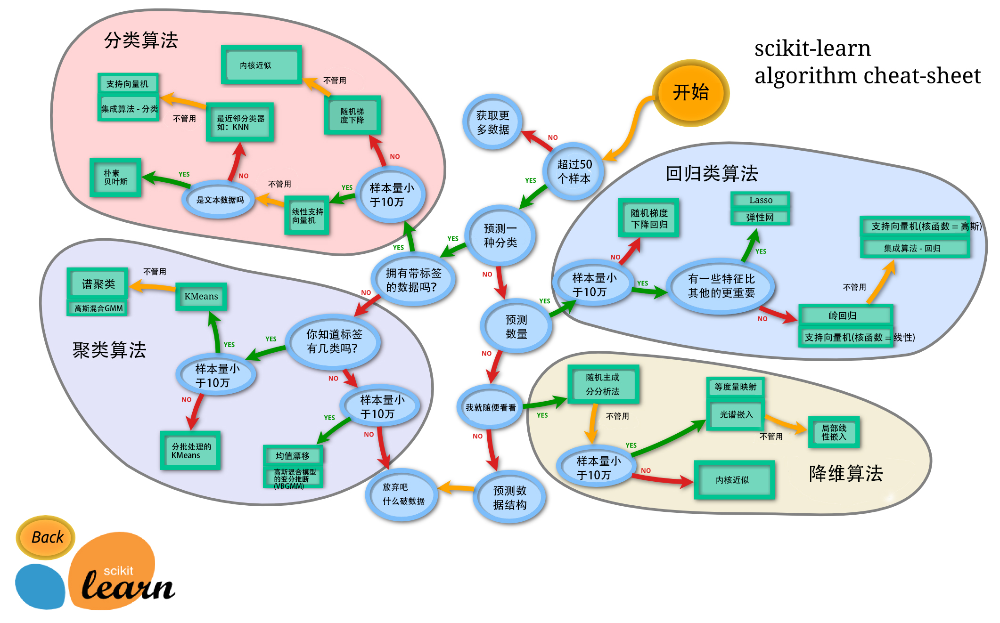
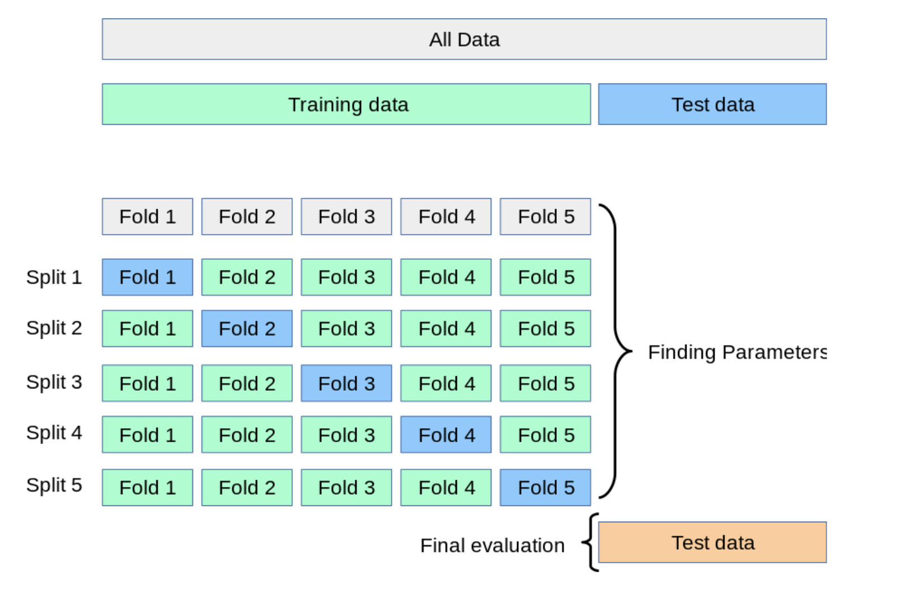

## 1、机器学习算法

机器学习，是一门多领域交叉学科，涉及概率论、统计学、逼近论、凸分析、算法复杂度理论等多门学科。专门研究计算机怎样模拟或实现人类的学习行为，以获取新的知识或技能，重新组织已有的知识结构使之不断改善自身的性能。

注：**机器学习内容很多很复杂，这个只是最简单的入门介绍**；**建议有空好好了解一下具体的算法原理**

### 1.1分类

1. #### **有监督学习**

    * **概念：**算法从有标记数据中学习。在理解数据之后，该算法通过将模式与未标记的新数据关联来确定应该给新数据赋哪种标签

    * **任务类型**

      * 分类任务：如垃圾邮件检测、情感分析、图片分类等
      * 回归任务：如房价预测、股价预测、身高-体重预测等
    * **算法**：KNN、线性回归、logistic回归、支持向量机（SVM）、决策树

2. #### **无监督学习**

    * **概念：**无监督学习的训练数据都是未经标记的，算法会在没有指导的情况下自动学习
    * **算法：**

      * **聚类算法**：K均值算法（K-means）、基于密度的聚类方法(DBSCAN)
      * **可视化和降维**：主成分分析、核主成分分析
      * **关联规则学习**：Apriori、Eclat

### 1.2 基本算法：

* 线性回归算法 Linear Regression
* 支持向量机算法 (Support Vector Machine,SVM)
* 最近邻居/k-近邻算法 (K-Nearest Neighbors,KNN)
* 逻辑回归算法 Logistic Regression
* 决策树算法 Decision Tree
* k-平均算法 K-Means
* 随机森林算法 Random Forest
* 朴素贝叶斯算法 Naive Bayes
* 降维算法 Dimensional Reduction
* 梯度增强算法 Gradient Boosting

### 1.3算法选择

见下方经典图片



## 2、分类任务

### 2.1概念

上面关于机器学习的介绍简单涉及了分类任务，它属于**有监督学习**的一种，也即数据集是包含标签的，如常见的新闻分类任务，每一个新闻文本都具有类别信息，在此数据上训练分类器来对没有标注的新闻数据进行预测；还有如图片分类任务，情感分析任务等等都属于分类任务的实际应用场景

### 2.2常见算法

任务不区分模型，不管是本次涉及的机器学习算法，还是日后涉及的深度学习算法，都可以解决分类问题，只是不同的算法表现不一样，常见的如下:

`SVM `-> `xgboost`-> `TextCNN` ->` TextRNN` -> `加Attention` -> `BERT精调` 

左边的SVM、xgboost为经典的机器学习算法，CNN、RNN为基础神经网络模型，后续以Transformer为主的注意力机制模型后又是更深更复杂的神级网络模型了，这些模型可认为性能从左至右依次递增（大多情况）；

之所以说这么多模型，其实一个原因是为了**写论文**做对比实验:emoji_其他平台/d_bingbujiandan:,一个模型不足以验证结论，那就来进行多个模型实验对比，证明某一个效果更好，大力出奇迹~

本次任务从最基础的机器学习算法说起，后续的将依次介绍；

### 2.3模型选择及评价

为了方便理解，举一个例子

> 现在假设，你是一个学校的主任，你要负责学校内多个班级的教学，理想化的认为班级内学生初始时水平都是一致的，现在要对这多个班级的学生使用教学资料进行教学，之后用试卷进行考核学生的掌握水平；
>
> 这个例子里，模型—学生，教学资料——数据集，试卷分数——评价指标；
>

#### 模型验证

简单的说，就如同对学生考试一样，对模型也需要进行评测；但是学生的试卷数不胜数，机器学习模型的评测语料却十分有限，为了解决这个问题，于是就对数据集进行切分，分为**训练集**（train）、**验证集**（dev）、**测试集**（test）

形象上来说**训练集**就像是学生的课本，学生 根据课本里的内容来掌握知识，**验证集**就像是模拟卷，通过模拟卷可以知道 不同学生学习情况、进步的速度快慢，而最终的**测试集**就像是考试，考的题是平常都没有见过，考察学生举一反三的能力；

一般划分的方式是训练集、验证集、测试集 = 8:1:1，不过更常见的一种方法是**交叉验证**，最基本的交叉验证方法是K折交叉验证（k-fold CV），它是指将训练集划分为k个最小的子集（如下的过程应用k“折叠”中的一个：



通过对数据进行划分，从而训练不同的模型，取效果最好模型作为最终结果，此方法在处理样本不足时很有用；

#### 参数调优

简单的说，现在机器学习算法都有封装好的库，使用的法直接调用即可，我们需要做的工作就是调整不同模型的参数，例如支持向量分类器的参数C，kernel和gamma，Lasso的参数alpha等，不同的参数最终的模型效果都会不一致，我们需要经过反复调试直到一个最佳的结果；

常见的方法：网格搜索、随机参数优化等

#### 评价指标

评价指标其实很好理解，就如同学生考试的分数一样，要有一个标准；

* 分类任务中常见指标有：**准确率（accuracy）、精确率（precision）、召回率（recall）、F1值**
* 回归任务中常见指标有：**均方误差**、**平均绝对误差**等
* 聚类任务中常见指标有：**兰德指数、互信息(mutual information)的得分**等

还有一些任务其实没有一个确定的评价指标，如文本生成任务，以机器翻译为例，模型的好坏无法直观的通过某个指标的得分来衡量，更多的是人工对其打分，因而评测方法也是NLP的研究之一

## 3、代码详解

机器学习的每一个算法背后都是很多复杂的公式以及逻辑，如果“徒手造轮子”其实难度挺大的，不过好在现在有很方便的API接口供我们直接调用，原本几百行的代码，现在只需要几行:emoji_其他平台/weibo_dog3:

不过有现成的接口不代表这些算法背后的原理不重要，如果你不了解原理，也可以实现任务，但是你会不清楚那些参数的意义，也不知道怎么调整才能使性能更优，因而强烈建议课后去自己了解这些底层的算法；

推荐资源：

* [amp;apachecn/ailearning: AiLearning：数据分析+机器学习实战+线性代数+PyTorch+NLTK+TF2 (github.com)](https://github.com/apachecn/ailearning)

把这个仓库下面的算法学会了这些机器学习算法就基本会了，代码都很完整，也有详细的讲解；

为节省时间，下面以机器学习skleran包进行代码讲解

### 3.1文本预处理

先简单说一下此次任务的数据集，来源是[此仓库](https://github.com/aceimnorstuvwxz/toutiao-text-classfication-dataset)，为今日头条15个类别的短新闻文本数据集，共**382688**条，具体类别如下

```python
100 民生 故事 news_story
101 文化 文化 news_culture
102 娱乐 娱乐 news_entertainment
103 体育 体育 news_sports
104 财经 财经 news_finance
106 房产 房产 news_house
107 汽车 汽车 news_car
108 教育 教育 news_edu 
109 科技 科技 news_tech
110 军事 军事 news_military
112 旅游 旅游 news_travel
113 国际 国际 news_world
114 证券 股票 stock
115 农业 三农 news_agriculture
116 电竞 游戏 news_game
```

先导入将要使用的包

```python
import pandas as pd
import numpy as np
import jieba
import time
import xgboost as xgb
from sklearn.svm import SVC
from sklearn import preprocessing, decomposition, model_selection, metrics, pipeline
from sklearn.model_selection import GridSearchCV
from sklearn.feature_extraction.text import TfidfVectorizer, CountVectorizer
from sklearn.decomposition import TruncatedSVD
from sklearn.linear_model import LogisticRegression
from sklearn.model_selection import train_test_split
from sklearn.metrics import classification_report
import joblib
```

因文本数量较多，且此次仅为培训演示，因而实验时仅截取前20000条数据

```python
    def pre_process(self):
        df = pd.read_csv('news.csv')
        data = df.iloc[:20000] # 截取前20000条
        jieba.enable_parallel(64)  # 并行分词开启
        data['文本分词'] = data['正文'].apply(lambda i: jieba.cut(i))
        data['文本分词'] = [' '.join(i) for i in data['文本分词']]
        print(data.head())
        df = data[['分类', '文本分词']]
        df.to_csv('fenci.csv') #保存为新文件主要是为了节省时间，不然每次切分会占据很长运行时间
```

预处理部分主要包括`数据读取`、`文本分词`、`存储文件`，解释一下分词的原因，结合`文本表示`那一部分介绍的内容，不管哪一种方式，都是对词语进行向量化表示，因而第一步就是对文本进行分词；

同时中文文本不同于英文有明显的空格标识符，因而这里使用的`jieba`包，可以对中文文本快速分词，后续任务也会介绍“分词”这一基础的序列标注任务；完成读取分词后后，保存新的文件供之后使用

```python
 def get_data(self):
     data = pd.read_csv('fenci.csv').iloc[:10000]
     lbl_enc = preprocessing.LabelEncoder()
     y = lbl_enc.fit_transform(data.分类.values)
     self.xtrain, self.xvalid, self.ytrain, self.yvalid = train_test_split(data.文本分词.values, y,stratify=y, random_state=42,test_size=0.1, shuffle=True)

```

`get_data`函数也就是上述提到了模型验证，当然这里并没有采用十折交叉法，而是简单的按9:1划分训练集和测试集；

### 3.2特征提取

这一部分就是“文本表示”的内容，我们知道了有多种表示方式，如One-Hot、TF-IDF、Word2Vec等等，而在机器学习算法里常用的就是词袋模型和TF-IDF两种方式，下面也就根据代码进行说明

#### 词袋模型

原理部分不解释了，这是上一个的任务之一，可以结合下面代码理解一下具体参数的含义

```python
    def word_count(self):
        ctv = CountVectorizer(min_df=3,
                              max_df=0.5,
                              ngram_range=(1, 2),
                              stop_words=self.stwlist)  # stop_words为停用词
        # 使用Count Vectorizer来fit训练集和测试集
        ctv.fit(list(self.xtrain) + list(self.xvalid))
        self.xtrain_ctv = ctv.transform(self.xtrain)
        self.xvalid_ctv = ctv.transform(self.xvalid)
```

#### TF-IDF

同上，结合原理理解参数的含义

```python
    def tf_idf(self):
        tfv = TfidfVectorizer(min_df=3,
                              max_df=0.5,
                              max_features=None,
                              ngram_range=(1, 2),
                              use_idf=True,
                              smooth_idf=True,
                              stop_words=self.stwlist)
        # 使用TF-IDF来fit训练集和测试集
        tfv.fit(list(self.xtrain) + list(self.xvalid))
        self.xtrain_tfv = tfv.transform(self.xtrain)
        self.xvalid_tfv = tfv.transform(self.xvalid)
```

### 3.3分类算法

上面也介绍了分类任务有多种算法，此次介绍三个不同类型的算法，线性模型（Linear Regression）、决策树模型（xgboost）以及核函数类型（SVM）;

下面的代码都实现了分类功能，且文本表示使用的是tf-idf特征，你也可以使用上述的CountVectorizer特征来比较哪个性能更好

#### 线性模型

这里以最简单的线性回归模型为例来完成分类任务，同样学习原理后结合代码理解参数的含义

```python
    def linear_regression(self):
        # 利用提取的TFIDF特征来fit一个简单的Logistic Regression
        clf = LogisticRegression(C=1.0, solver='lbfgs', multi_class='multinomial')
        clf.fit(self.xtrain_tfv, self.ytrain)
        predictions = clf.predict_proba(self.xvalid_tfv)
        self.evaluate(self.yvalid, clf.predict(self.xvalid_tfv), predictions)
```

#### 决策树模型

决策树模型其实是很大一类，包括决策树、随机森林、xgboost等等，这里以性能比较优秀的xgboost进行演示

```python
    def xgboost(self):
        # 基于tf-idf特征，使用xgboost
        clf = xgb.XGBClassifier(max_depth=7, n_estimators=200, colsample_bytree=0.8,
                                subsample=0.8, nthread=10, learning_rate=0.1)
        clf.fit(self.xtrain_tfv.tocsc(), self.ytrain)
        predictions = clf.predict_proba(self.xvalid_tfv.tocsc())
        self.evaluate(self.yvalid, clf.predict(self.xvalid_tfv), predictions)
```

#### 核函数类型

支持向量机这个算法是经典的机器学习算法，在很多任务上甚至可以和后来的深度学习模型相媲美，因而很有必要介绍一下

```python
    def svm(self):
        # 使用SVD进行降维，components设为120，对于SVM来说，SVD的components的合适调整区间一般为120~200
        svd = decomposition.TruncatedSVD(n_components=120)
        svd.fit(self.xtrain_tfv)
        xtrain_svd = svd.transform(self.xtrain_tfv)
        xvalid_svd = svd.transform(self.xvalid_tfv)
        # 对从SVD获得的数据进行缩放
        scl = preprocessing.StandardScaler()
        scl.fit(xtrain_svd)
        xtrain_svd_scl = scl.transform(xtrain_svd)
        xvalid_svd_scl = scl.transform(xvalid_svd)
        # 调用下SVM模型
        clf = SVC(C=1.0, probability=True)  # since we need probabilities
        clf.fit(xtrain_svd_scl, self.ytrain)
        predictions = clf.predict_proba(xvalid_svd_scl)
        self.evaluate(self.yvalid, clf.predict(self.xvalid_tfv), predictions)
```

### 3.4模型评价

上述已经介绍了原理，这里放一下代码

`classification_report`可以直接打印每一类别的p、r、f值，而下述的`multiclass_logloss`是多分类性能的另一个评价指标

```python
    def evaluate(self, yvalid, y_predict, predictions):
        print(classification_report(yvalid, y_predict))
        print("logloss: %0.3f " % self.multiclass_logloss(yvalid, predictions))

    @staticmethod
    def multiclass_logloss(actual, predicted, eps=1e-15):
        """对数损失度量（Logarithmic Loss  Metric）的多分类版本。
        :param actual: 包含actual target classes的数组
        :param predicted: 分类预测结果矩阵, 每个类别都有一个概率
        """
        # Convert 'actual' to a binary array if it's not already:
        if len(actual.shape) == 1:
            actual2 = np.zeros((actual.shape[0], predicted.shape[1]))
            for i, val in enumerate(actual):
                actual2[i, val] = 1
            actual = actual2

        clip = np.clip(predicted, eps, 1 - eps)
        rows = actual.shape[0]
        vsota = np.sum(actual * np.log(clip))
        return -1.0 / rows * vsota
```

### 3.5参数调优

3.3部分介绍了三个模型，可以发现代码很简洁，模型训练就一行关键代码，但是每一个模型里都有很多不同的参数，这个就是需要自己去掌握的了；而所谓的参数调优就是调整这些参数，一种比较简单粗暴的方法就是一个一个试，这当然可以，但是效率太慢，而`grid search`就可以帮助我们解决这个问题

#### Grid search

原理部分自己去找找官方文档，介绍的很详细了，这里贴一下代码；

此处以`LogisticRegression`模型为例进行演示，当然也可以对SVM等进行调优

```python
    def grid_search(self):
        mll_scorer = metrics.make_scorer(self.multiclass_logloss, greater_is_better=False, needs_proba=True)
        # SVD初始化
        svd = TruncatedSVD()
        # Standard Scaler初始化
        scl = preprocessing.StandardScaler()
        # 再一次使用Logistic Regression
        lr_model = LogisticRegression()
        # 创建pipeline
        clf = pipeline.Pipeline([('svd', svd),
                                 ('scl', scl),
                                 ('lr', lr_model)])

        param_grid = {'svd__n_components': [120, 180],
                      'lr__C': [0.1, 1.0, 10],
                      'lr__penalty': ['l1', 'l2']}
        # 网格搜索模型（Grid Search Model）初始化
        model = GridSearchCV(estimator=clf, param_grid=param_grid, scoring=mll_scorer,
                             verbose=10, n_jobs=-1, refit=True, cv=2)

        # fit网格搜索模型
        model.fit(self.xtrain_tfv, self.ytrain)  # 为了减少计算量，这里我们仅使用xtrain
        print("Best score: %0.3f" % model.best_score_)
        print("Best parameters set:")
        best_parameters = model.best_estimator_.get_params()
        for param_name in sorted(param_grid.keys()):
            print("\t%s: %r" % (param_name, best_parameters[param_name]))
```

### 3.6模型应用

完成上面这些步骤你就获得了一个性能还不错的分类器，下面就是模型保存及预测了；

模型保存主要是使用`joblib`这个包，它的`dump`方法可以将模型保存到本地，当调用时使用其的`load`方法就好了；

注：tf-idf模型也需要保存，否则无法对输入的文本进行处理

```python
    def save_model(self, model, path):
        joblib.dump(model, path)
        print("Model is done")

    def model_predict(self, text, classfication_model_path, tf_path):
        tfidf_model = joblib.load(tf_path)
        classfication_model = joblib.load(classfication_model_path)
        text1 = [" ".join(jieba.cut(text))]
        # 进行tfidf特征抽取
        text2 = tfidf_model.transform(text1)
        predict_type = classfication_model.predict(text2)[0]
        print(predict_type)

    #以线性模型为例，想保存它时
    def linear_regression(self):
        # 利用提取的TFIDF特征来fit一个简单的Logistic Regression
        clf = LogisticRegression(C=1.0, solver='lbfgs', multi_class='multinomial')
        clf.fit(self.xtrain_tfv, self.ytrain)
        predictions = clf.predict_proba(self.xvalid_tfv)
        self.evaluate(self.yvalid, clf.predict(self.xvalid_tfv), predictions)

	# 这一步就是保存模型
        self.save_model(clf, './model/lr.m')  
```

完成后，你就可以输入一段文本来测试效果，不过要考虑一点，`model_predict`返回的是类别序号，而不是具体的名称，这个得你们自己想办法解决一下；

## 4、任务

### 说明

* 根据上述每个步骤的参考代码，实现文本分类的完整流程；
* 对3.1—3.6涉及的每个函数及必要代码进行注释，函数需注明作用、参数、返回值；重要代码需解释作用，类似下面这个

  * ```python
        def model_predict(self, text, classfication_model_path, tf_path):
            """
            :param text: 单个文本
            :param classfication_model_path: 分类模型位置
            :param tf_path: 向量器模型位置
            :return: 返回预测概率和预测类别
            """
            tfidf_model = joblib.load(tf_path)
            classfication_model = joblib.load(classfication_model_path)
            text1 = [" ".join(jieba.cut(text))]
            # 进行tfidf特征抽取
            text2 = tfidf_model.transform(text1)
            predict_type = classfication_model.predict(text2)[0]
            print(predict_type)
    ```
* 记录不同模型评测的p、r、F1值，输出到txt文件，并自己调试模型参数，记录结果；
* 保存分类器模型后，自己写一个调用模型的接口函数，可以实现输入一个句子，返回该句子的类别；
* 课后自己找机器学习的相关书籍、视频进行学习，理解原理，并回答下面的问题，结果存为md文件或word文件<u>（自己去找论文、博客、视频，可参考之前发群里的“0-培训说明”里提及的资源）</u>

  * 除了监督学习、无监督学习还有那些类型的机器学习算法？并做简要概述
  * 线性模型、决策树类型、核函数类型都有哪些代表算法？
  * 解释一下k-fold交叉验证及作用
  * 欠拟合、过拟合是什么意思
  * 对P、R、F值做出详细介绍，并举一个例子来计算
  * 列举一下除了本文介绍的p、r、f值外地评测指标，分类任务、聚类任务等都可以
  * 解释一下机器学习里`Bagging`、`Boosting`的含义
  * 列举svm算法里重要的参数并解释含义

### 提交文件

1. `TextClassfication.py ` 即文本分类的代码
2. `model文件夹`包含训练好的分类器模型、特征提取模型
3. `interface.py`即模型接口文件，输入句子返回类别
4. `eval.txt`即不同分类模型的评测结果，记录不同参数下的模型p、r、f值
5. `题目.md`即上述八个问题的答案，该文件提交到QQ群

### 提交方式

* 1-4同任务一，在服务器运行，并保留代码文件及结果；
* 5`题目.md`提交到QQ

### 截止时间：3.25

## 5、参考

原理部分及代码相关API等看下面这个skleran的官方文档就够了；深入了解可以看看《机器学习》西瓜书，《统计机器学习》等

* [用户指南-scikit-learn中文社区](https://scikit-learn.org.cn/lists/2.html)
